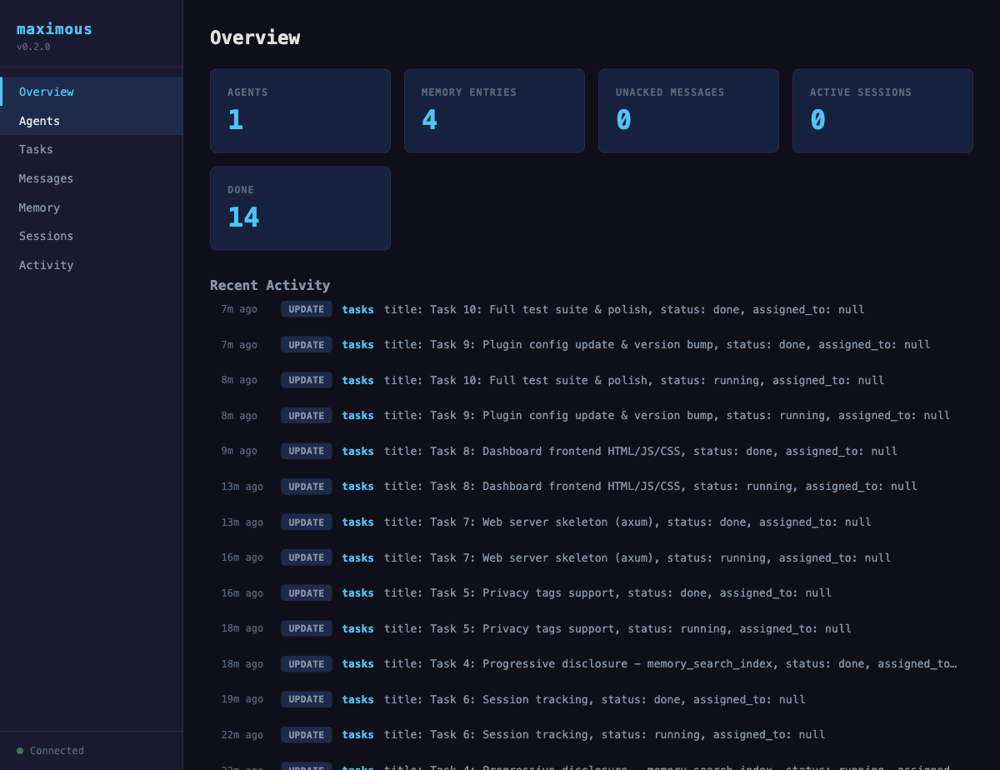
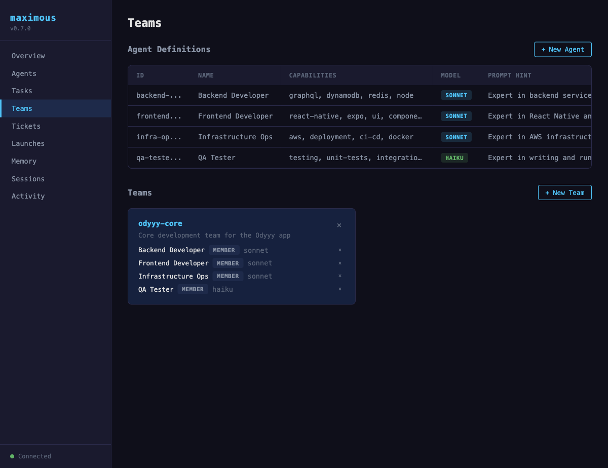
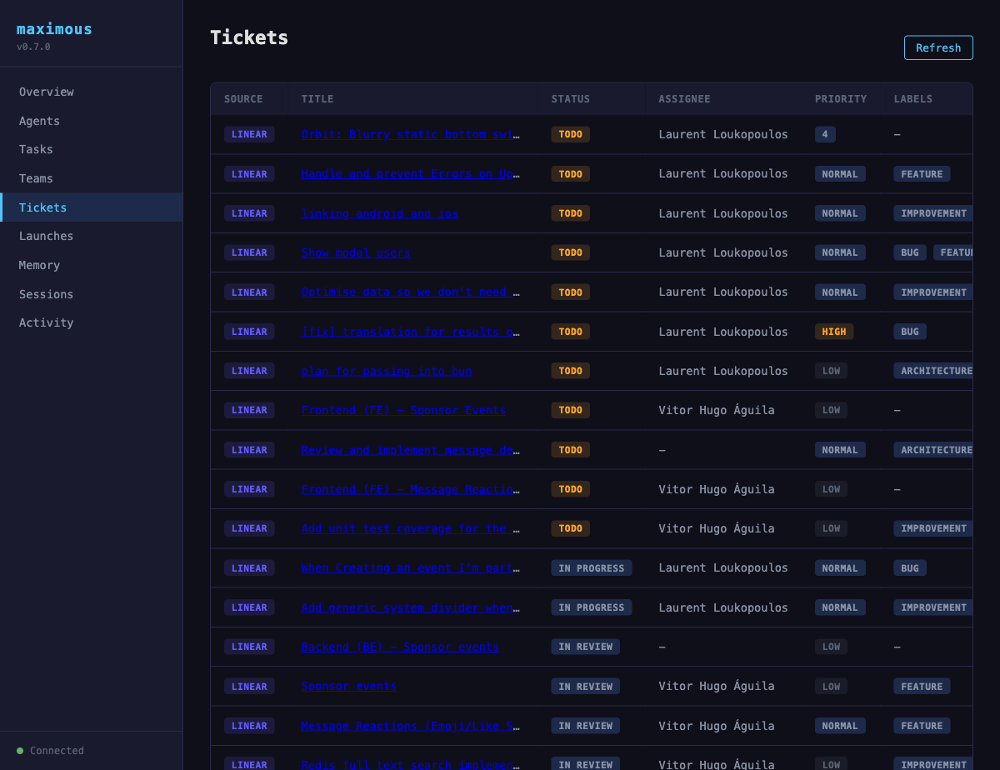
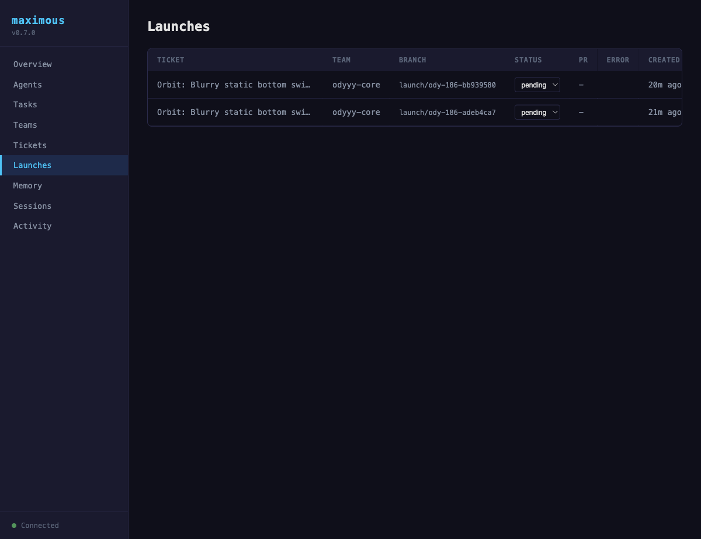

# Maximous

A SQLite brain for Claude Code — session continuity, subagent knowledge persistence, multi-instance awareness, and multi-agent orchestration. Single Rust binary, zero runtime dependencies.

Maximous enhances Claude Code with persistent context that survives across sessions, preserves subagent findings before they're compressed, and coordinates parallel agents through a shared SQLite database via MCP.

<p align="center">
  
  <br>
  <em>Real-time web dashboard with agent registry, team management, ticket tracking, and launch orchestration</em>
</p>

## How It Works

```
Agent A (subagent)  --stdio-->  maximous process A  --WAL--+
Agent B (subagent)  --stdio-->  maximous process B  --WAL--+-->  brain.db
Agent C (team)      --stdio-->  maximous process C  --WAL--+
                                                            |
                              Web Dashboard  <--HTTP/SSE----+
                              http://127.0.0.1:8375
```

Each agent spawns its own MCP server process. All processes share a single SQLite file using WAL mode (concurrent reads, serialized writes, crash-safe). The optional web dashboard provides a real-time view into all agent activity.

### What Agents Can Do

| Domain | Tools | Purpose |
|---|---|---|
| **Memory** | `memory_set`, `memory_get`, `memory_search`, `memory_search_index`, `memory_delete` | FTS5-powered shared knowledge store with typed observations, privacy tags, and progressive disclosure |
| **Tasks** | `task_create`, `task_update`, `task_list` | Task board with dependencies and pagination |
| **Agents** | `agent_register`, `agent_heartbeat`, `agent_list`, `agent_define`, `agent_remove`, `agent_catalog` | Agent registry with heartbeat and reusable definitions |
| **Teams** | `team_create`, `team_list`, `team_delete`, `team_add_member`, `team_remove_member` | Compose agents into named teams for coordinated work |
| **Tickets** | `ticket_cache`, `ticket_list`, `ticket_get`, `ticket_clear` | Cache and track external tickets (Linear, Jira) |
| **Launches** | `launch_create`, `launch_update`, `launch_list`, `launch_delete` | Assign tickets to teams, track execution status and PRs |
| **Sessions** | `session_start`, `session_end`, `session_list` | Track agent work sessions with summaries |
| **Observe** | `poll_changes` | Watch for state changes across all tables |

**30 tools** across 8 domains.

## Key Features

### FTS5 Full-Text Search
Memory search uses SQLite FTS5 for ranked results instead of basic LIKE queries. Supports FTS5 syntax (AND, OR, NOT, phrases).

### Progressive Disclosure
`memory_search_index` returns compact results (~50-100 tokens each) with snippets and token estimates. Use `memory_get` to fetch full values only when needed. 10x token savings vs fetching everything.

### Typed Observations
Tag memory entries with `observation_type` (decision, error, preference, insight, pattern, learning) and `category` (architecture, debugging, workflow, api, ui, data, config) for structured knowledge capture.

### Privacy Tags
Wrap sensitive data in `<private>...</private>` tags. It's stored in the database but redacted to `[REDACTED]` on all read operations.

### Session Continuity
Automatic hooks preserve context across Claude Code sessions:

- **SessionStart** — loads previous session context from maximous memory
- **SessionEnd** — saves structured summary of what was accomplished
- **SubagentStop** — preserves detailed subagent findings before context compression
- **PreCompact** — saves critical in-progress state before context window compression

Reserved namespaces: `sessions`, `agent-findings`, `context-preservation`.

### Web Dashboard
Built-in web dashboard at `http://127.0.0.1:8375` with 9 views:
- **Overview** — stat cards + activity feed
- **Agents** — registry with heartbeat status
- **Tasks** — table with status/priority badges and dependencies
- **Teams** — agent definitions, team composition with add/remove members
- **Tickets** — cached Linear/Jira tickets with status, priority, labels, and launch buttons
- **Launches** — ticket-to-team assignments with status tracking, branch names, and PR links
- **Memory** — 3-pane namespace/key/value explorer
- **Sessions** — session history with summaries
- **Activity** — real-time change feed via SSE

<p align="center">
  
  <br>
  <em>Teams view: define agents, compose teams, add/remove members</em>
</p>

<p align="center">
  
  <br>
  <em>Tickets view: cached Linear tickets with priority badges, status, and one-click launch</em>
</p>

<p align="center">
  
  <br>
  <em>Launches view: track ticket execution across teams with status, branches, and PR links</em>
</p>

Start the dashboard:
```bash
# Start dashboard (auto-opens browser)
maximous dashboard

# Custom port
maximous dashboard --port 9000

# Custom database path
maximous --db /path/to/brain.db dashboard
```

The dashboard automatically opens `http://127.0.0.1:8375` in your browser. It reads from the same `brain.db` that agents write to, so you see live data. SSE (Server-Sent Events) pushes changes to the browser automatically -- no manual refresh needed.

**Note:** The web dashboard runs instead of the MCP server (not alongside it). Your agents use the MCP stdio server as usual; the dashboard is a separate process for human observation.

### Pagination
All list endpoints support `limit` and `offset` parameters for efficient pagination.

## Installation

### As a Claude Code plugin (recommended)

First, add the marketplace:

```
/plugin marketplace add https://github.com/awesome-lab/claude-plugins
```

Then install the plugin from the marketplace:

```
/plugin install maximous
```

Or browse available plugins interactively with `/plugin` -> **Discover** tab.

This installs maximous as a plugin with all skills, hooks, and the MCP server. The binary needs to be available -- either build from source or download a release.

### Download pre-built binary

```bash
curl -fsSL https://raw.githubusercontent.com/awesome-lab/maximous/main/scripts/install.sh | bash
```

This detects your OS and architecture, downloads the correct binary from GitHub Releases, and installs it to `~/.cargo/bin/`.

Supported platforms: macOS (arm64, x86_64), Linux (arm64, x86_64).

### Build from source

```bash
git clone https://github.com/awesome-lab/maximous.git
cd maximous
cargo build --release
```

To install globally:

```bash
cargo install --path .
```

### Manual MCP setup (without plugin)

If you just want the MCP server without the full plugin, add to your project's `.mcp.json`:

```json
{
  "mcpServers": {
    "maximous": {
      "command": "maximous",
      "args": ["--db", ".maximous/brain.db"]
    }
  }
}
```

## Usage

Claude Code auto-spawns the MCP server and makes all 30 tools available to agents. The SessionStart hook runs automatically every session to ensure the binary and `.maximous/` directory exist.

### Skills

The plugin includes skills that teach agents how to use maximous. Skills trigger automatically based on what you say:

| Skill | Trigger examples | Purpose |
|---|---|---|
| **session-continuity** | "resume previous work", "pick up where I left off" | Cross-session context persistence |
| **orchestrate** | "orchestrate agents", "set up multi-agent workflow" | Set up full multi-agent workflows |
| **coordinate** | "manage tasks", "create task graph" | Task lifecycle and dependency management |
| **teams** | "define agents", "create teams", "manage team members" | Agent definitions and team composition |
| **memory** | "store this in memory", "share data between agents" | Shared key-value storage with TTL |
| **observe** | "watch for changes", "poll for updates" | Watch for state changes via polling |
| **status** | "maximous status", "show agent status" | Quick overview of current state |
| **cleanup** | "clean up maximous", "expire old data" | Expire stale data and maintain the database |
| **dashboard** | "open dashboard", "show dashboard" | Open the web dashboard in your browser |

### When Does Maximous Activate?

Maximous hooks run automatically in every session:

- **Session continuity** — summaries are saved at session end and loaded at session start, so Claude can pick up where it left off
- **Subagent persistence** — when subagents finish, their detailed findings are preserved in memory before context compression discards them
- **Context preservation** — before the context window is compressed, important in-progress state is saved

Beyond automatic hooks, maximous is also used when you:

- **Run parallel subagents** that need to share data
- **Set up task graphs** with dependencies between agents
- **Need agents to communicate** with each other via message channels
- **Want to observe** when another agent finishes a task

### Standalone

```bash
# Start the MCP server (reads JSON-RPC from stdin, writes to stdout)
maximous --db .maximous/brain.db

# Start web dashboard (auto-opens browser)
maximous dashboard

# Dashboard with custom port and database
maximous --db /tmp/my-project.db dashboard --port 9000
```

### Quick smoke test

```bash
echo '{"jsonrpc":"2.0","id":1,"method":"initialize","params":{"protocolVersion":"2024-11-05","capabilities":{}}}' | maximous --db /tmp/test.db
```

Should return:
```json
{"jsonrpc":"2.0","id":1,"result":{"capabilities":{"tools":{}},"protocolVersion":"2024-11-05","serverInfo":{"name":"maximous","version":"0.7.1"}}}
```

## Multi-Agent Example

Here's how agents coordinate through maximous:

```
1. Orchestrator creates tasks with dependencies:
   task_create("parse-api", deps=[])
   task_create("build-ui", deps=["parse-api"])

2. Agent A picks up "parse-api", runs it, stores result:
   memory_set("task-results", "parse-api", {"endpoints": ["/users"]},
              observation_type="decision", category="api")
   task_update("parse-api", status="done")

3. Agent B polls for changes:
   poll_changes(since_id=5)  -->  sees "parse-api" is done

4. Agent B searches memory efficiently:
   memory_search_index("api endpoints")  -->  compact index with token estimates
   memory_get("task-results", "parse-api")  -->  full value when needed

5. Agents communicate via messages:
   message_send(channel="team", sender="agent-b", content="which framework?")

6. Track work sessions:
   session_start(agent_id="agent-b")
   // ... do work ...
   session_end(id="...", summary="Built UI components for /users endpoint")
```

## Architecture

```
maximous/
├── Cargo.toml
├── .claude-plugin/      # Plugin manifest
│   └── plugin.json
├── .mcp.json            # MCP server config
├── skills/              # 8 agent skills
├── hooks/               # SessionStart, SessionEnd, SubagentStop, PreCompact hooks
├── scripts/             # Launcher, installer, db init
├── web/                 # Dashboard frontend (compiled into binary)
│   ├── index.html
│   ├── app.js
│   └── style.css
├── src/
│   ├── main.rs          # CLI entry: subcommands (default=MCP, dashboard=web)
│   ├── lib.rs           # Library root
│   ├── db.rs            # SQLite init, WAL mode, migrations
│   ├── schema.sql       # 11 tables, indexes, triggers, FTS5
│   ├── mcp.rs           # JSON-RPC types, stdio loop, 30 tool defs
│   ├── tools/
│   │   ├── mod.rs       # ToolResult type, dispatch router
│   │   ├── memory.rs    # FTS5 search, observations, privacy, progressive disclosure
│   │   ├── tasks.rs     # Dependency graph, status lifecycle
│   │   ├── agents.rs    # Registry with heartbeat
│   │   ├── definitions.rs # Reusable agent definitions (define, catalog, remove)
│   │   ├── teams.rs     # Team composition and member management
│   │   ├── tickets.rs   # External ticket caching (Linear, Jira)
│   │   ├── launches.rs  # Ticket-to-team launch tracking
│   │   ├── sessions.rs  # Session tracking
│   │   └── changes.rs   # Observation/change log polling
│   └── web/
│       ├── mod.rs       # Axum router, static assets via rust-embed
│       └── api.rs       # REST endpoints + SSE stream
├── tests/               # 155 tests
├── benches/             # Criterion benchmarks
└── .github/workflows/   # CI + release builds
```

### Database Schema

11 tables + FTS5 + change log, connected by SQLite triggers:

- **memory** — `(namespace, key)` primary key, JSON values, optional TTL, observation_type, category
- **memory_fts** — FTS5 virtual table for ranked full-text search
- **tasks** — UUID ID, status lifecycle (pending/ready/running/done/failed), JSON dependencies
- **agents** — heartbeat-based liveness, JSON capabilities
- **agent_definitions** — reusable agent templates with capabilities, model, and prompt hints
- **teams** — named groups with description
- **team_members** — agent-to-team assignments with roles
- **tickets** — cached external tickets (Linear, Jira) with status, priority, labels, assignee
- **launches** — ticket-to-team execution records with branch, status, PR URL, error tracking
- **sessions** — agent work sessions with start/end times and summaries
- **changes** — auto-populated by triggers on INSERT/UPDATE/DELETE across all tables
- **config** — simple key-value settings

### Design Decisions

| Decision | Why |
|---|---|
| Rust | Single binary, no runtime, sub-ms startup |
| stdio MCP | Native Claude Code integration, no networking, no auth |
| SQLite WAL | Crash recovery, multi-process safe, concurrent reads |
| FTS5 | Ranked full-text search with minimal overhead |
| Triggers | Changes table auto-populated, zero application code needed |
| Lazy TTL | No background threads, expiry on read |
| axum + rust-embed | Dashboard compiled into binary, no separate process |
| SSE | Real-time updates from changes table, simpler than WebSocket |

## Development

### Setup

```bash
git clone https://github.com/awesome-lab/maximous.git
cd maximous
cargo build
```

### Running tests

```bash
# All tests (155 total)
cargo test

# Specific test suite
cargo test --test memory_test
cargo test --test tasks_test
cargo test --test agents_test
cargo test --test definitions_test
cargo test --test team_tools_test
cargo test --test tickets_test
cargo test --test launches_test
cargo test --test changes_test
cargo test --test sessions_test
cargo test --test pagination_test
cargo test --test observation_test
cargo test --test progressive_test
cargo test --test privacy_test
cargo test --test integration_test
cargo test --test teams_integration_test
cargo test --test concurrent_test
cargo test --test mcp_test
cargo test --test db_test
```

### Running benchmarks

```bash
cargo bench
```

Benchmarks cover:
- Memory set+get round-trip latency
- Write throughput
- Message send+read latency
- `poll_changes` scaling (100 to 50,000 rows)
- Task creation with dependency validation
- Memory search scaling (100 to 10,000 entries)

### Project structure for contributors

| File | Responsibility |
|---|---|
| `src/db.rs` | Database initialization and migrations. Change schema in `schema.sql`. |
| `src/schema.sql` | All tables, indexes, triggers, FTS5. Single source of truth. |
| `src/mcp.rs` | JSON-RPC protocol and tool definitions. Add new tools here first. |
| `src/tools/mod.rs` | Dispatch router. Wire new tools here. |
| `src/tools/*.rs` | One file per domain. Each tool is a pure function `(args, conn) -> ToolResult`. |
| `src/web/mod.rs` | Axum router and static asset serving. |
| `src/web/api.rs` | REST API endpoints and SSE stream. |
| `web/*.html/js/css` | Dashboard frontend. Compiled into binary via rust-embed. |

### Adding a new tool

1. Define the tool schema in `src/mcp.rs` in `tool_definitions()`
2. Create the function in the appropriate `src/tools/*.rs` file
3. Wire it in `src/tools/mod.rs` `dispatch_tool()`
4. Add tests in `tests/`
5. Update the tool count assertion in `tests/mcp_test.rs`

### Code conventions

- Every tool function has the signature `fn(args: &Value, conn: &Connection) -> ToolResult`
- Use `ToolResult::success(json)` or `ToolResult::fail("message")`
- Validate required fields at the top of each function
- Use `rusqlite::params![]` for parameterized queries (never string interpolation)
- Tests use `Connection::open_in_memory()` with `db::init_db()` for isolation

### Releasing

Tag a version to trigger cross-platform builds and a GitHub Release:

```bash
git tag v0.7.1
git push origin v0.7.1
```

GitHub Actions builds binaries for macOS (arm64, x86_64) and Linux (arm64, x86_64), then creates a release with the tarballs attached.

## Contributing

1. Fork the repo
2. Create a feature branch (`git checkout -b feat/my-feature`)
3. Write tests first, then implement
4. Run `cargo test` -- all tests must pass
5. Run `cargo clippy` -- no warnings
6. Submit a pull request

## License

MIT
